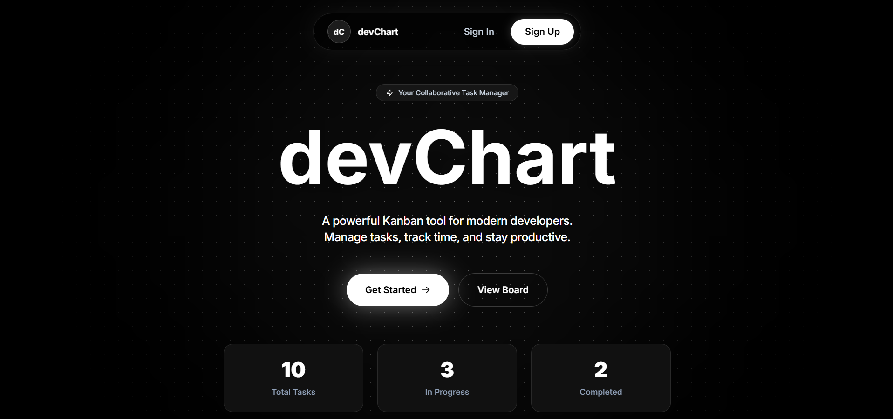
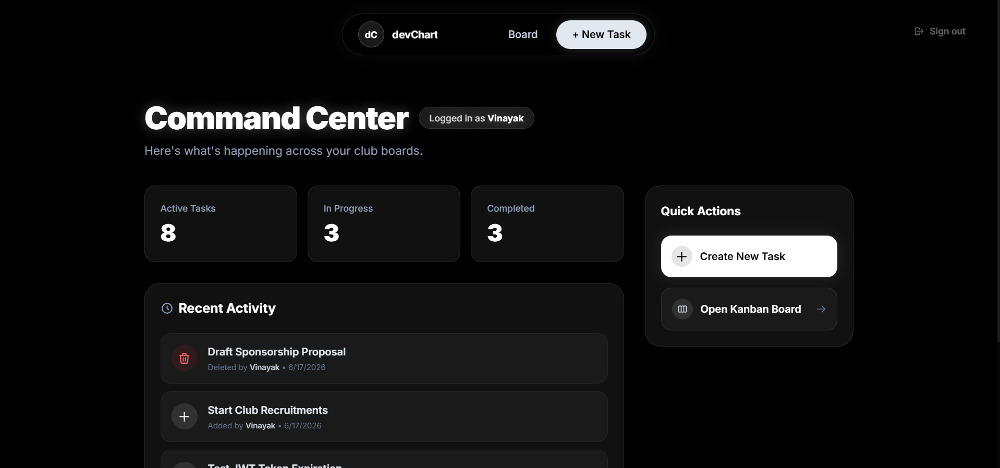
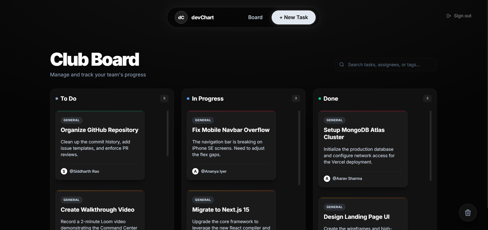
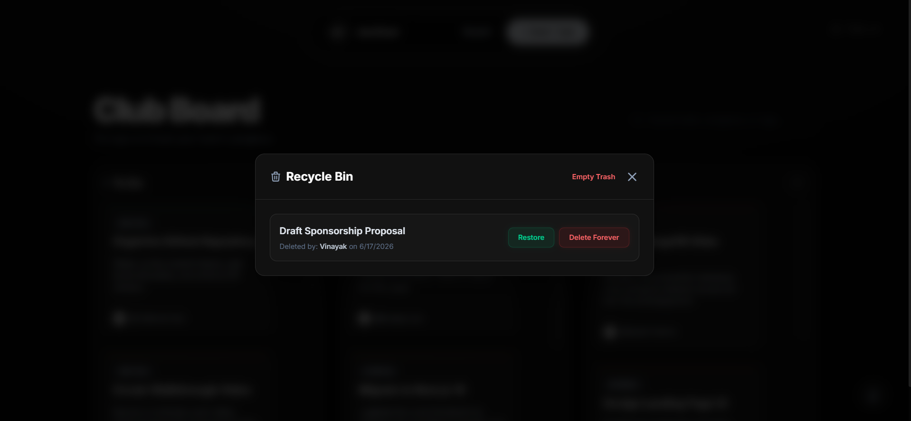
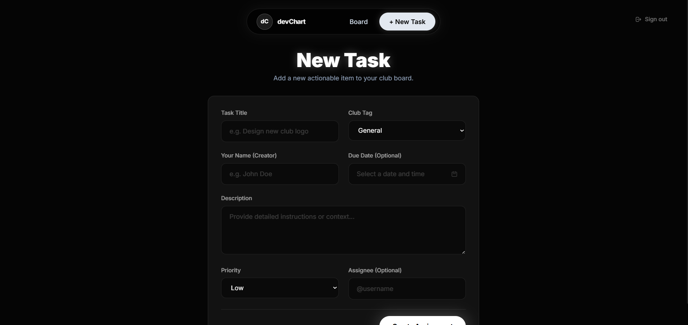

<div align="center">
  <br />
  <h1>🚀 devChart</h1>
  <br />
  <p><strong>A powerful Kanban tool for modern developers.</strong></p>
  <p>Manage tasks, track time, and stay productive.</p>

  <p align="center">
    <a href="https://dev-chart-five.vercel.app/" target="_blank">
      
    </a>
    
    
    
    
  </p>
</div>

<br />
<hr />
<br />

## Project Overview

devChart is a full-stack, Next.js-powered task management platform specifically designed for student clubs and early-career software teams. It provides a synchronized, highly aesthetic workspace where teams can seamlessly track progress. A user can securely sign up and instantly gain access to a collaborative Kanban board and an intelligent Command Center that tracks team productivity in real-time.

## Features Implemented

- **Interactive Kanban Board:** A highly responsive drag-and-drop task board with smooth, dynamic interactions and categorization.
- **Command Center:** View active, in-progress, and completed tasks at a glance with live metrics and recent activity feeds.
- **Modern Authentication:** Secure JWT-based password logins and email-based passwordless OTP integration via Resend.
- **Progressive Web App (PWA):** Installable natively on iOS, Android, and Desktop environments for lightning-fast, native-app access with offline caching capabilities.
- **Soft Deletes & Activity Logs:** Never lose track of who deleted what with built-in recycle bins and activity tracking.
- **Extreme UI/UX:** Dark mode by default, glassmorphism components, micro-animations, scalable SVG icons, and custom typography for a truly premium feel.

## Technology Stack Used

- **Frontend Framework:** Next.js 16 (App Router) & React 19
- **Styling:** Tailwind CSS with custom glassmorphism and animation extensions
- **Database:** MongoDB Atlas (Mongoose ORM)
- **Authentication:** Custom JWT-based stateless sessions + Resend API
- **PWA Integration:** `@serwist/next`
- **Deployment:** Vercel

## Setup Instructions

1. **Clone the repository:**
   ```bash
   git clone https://github.com/CraxCurl/devChart.git
   cd devChart
   ```

2. **Install dependencies:**
   ```bash
   npm install
   ```

3. **Environment Variables:**
   Create a `.env.local` file in the root directory and add the following:
   ```env
   MONGODB_URI=your_mongodb_connection_string
   JWT_SECRET=your_super_secret_jwt_key
   RESEND_API_KEY=your_resend_api_key_for_otp
   ```

4. **Run the development server:**
   ```bash
   npm run dev
   ```
   Open [http://localhost:3000](http://localhost:3000) with your browser to see the result.

## Deployment Instructions

This project is fully optimized for deployment on Vercel.

1. Create a free account on [Vercel](https://vercel.com).
2. Click **Add New** > **Project**.
3. Import your GitHub repository (`devChart`).
4. Keep the framework preset as **Next.js**.
5. Add the three Environment Variables from your local `.env.local` file.
6. Click **Deploy**. Vercel will automatically build the site and provide a live URL.

## Screenshots of the Working

*(Place your screenshots in the `public/screenshots` folder and the images will load here!)*

### Landing Page


### Command Center


### Kanban Board


### Recycle Bin Modal


### Create New Task

